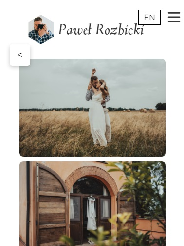
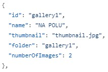

# Photographer's Website

## Description
A photographer's website built with React, designed to showcase a portfolio and allow easy contact with the photographer. The site is crafted for aesthetic presentation of photos and simple navigation. The page is currently under reconstruction.

## Website Link
[http://rozbickipawel.pl/](http://rozbickipawel.pl/)

## Features
- 🖼️ Portfolio showcase
- 📬 Contact form to reach the photographer
- 💻 Responsive design, adaptable to various screen resolutions

## Technology
- React

## Screenshots

## Custom solution
In order for the website owner to easily add new galleries and photos without a special interface, the ability to provide gallery settings in the [galleriesConfig.json](https://github.com/rafalwizen/photographer-website/blob/master/config/galleriesConfig.json) file has been implemented:

- name - description of the gallery on the thumbnail
- thumbnail - file name of the gallery thumbnail
- folder - folder name
- numberOfImages - number of images in the gallery

Each image in the gallery must be named "N-small.jpg", where N is the next natural number

## Contact
If you'd like to get in touch, please write to: [rafal.wizen@gmail.com](mailto:rafal.wizen@gmail.com)

## License
This project is licensed under the MIT License.
