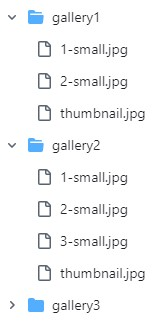

#  Strona dla fotografa

## Opis
Strona internetowa dla fotografa, napisana w technologii React, umożliwiająca prezentację portfolio oraz kontakt z autorem. Strona zaprojektowana z myślą o estetycznym przedstawieniu zdjęć i łatwym nawigowaniu. Strona chwilowo w przebudowie.

## Link do strony
[http://rozbickipawel.pl/](http://rozbickipawel.pl/)

## Funkcjonalności
- 🖼️ Prezentacja portfolio fotograficznego
- 📬 Możliwość kontaktu z fotografem przez formularz kontaktowy
- 💻 Responsywny design, dopasowany do różnych rozdzielczości ekranów

## Technologia
- React

## Screeny ze strony

## Autorskie rozwiązanie 
Aby właściciel strony mógł łatwo dodawać nowe galerie oraz zdjęcia ale bez specjalnego interfejsu zostałą zaimpelmentowana mozliwość podania ustawie galerii w pliku [galleriesConfig.json](https://github.com/rafalwizen/photographer-website/blob/master/config/galleriesConfig.json):

- name - opis galerii na miniaturze,
- thumbnail - nazwa pliku z miniaturą galerii
- folder - nazwa folderu
- numberOfImages - ilość zdjęć w galerii

Każde zdjęcie w galerii musi być nazwane "N-small.jpg", gdzie N to kolejna liczba naturalna

## Kontakt
Jeśli chcesz się skontaktować, napisz na: [rafal.wizen@gmail.com](mailto:rafal.wizen@gmail.com)

## Licencja
Projekt jest na licencji MIT.
